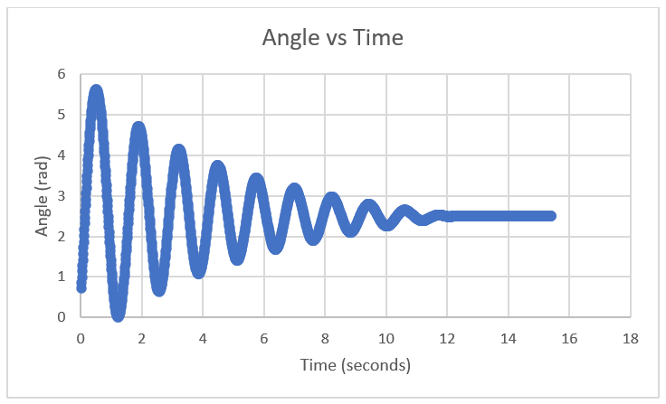
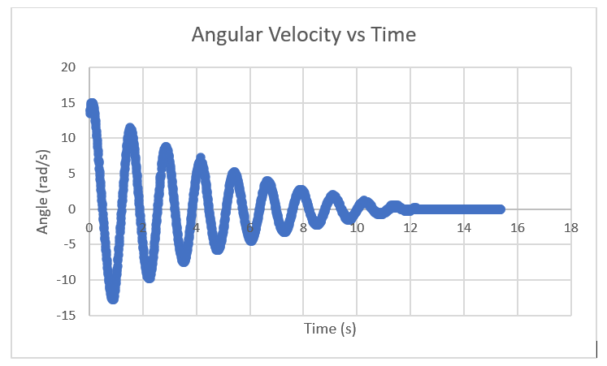
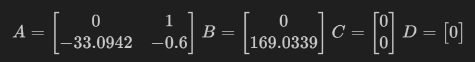
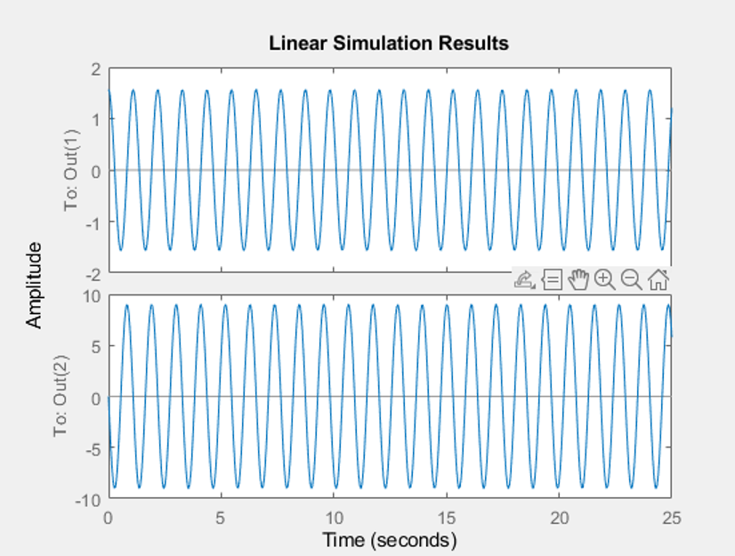
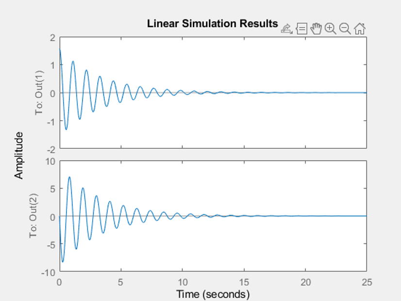
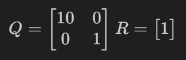
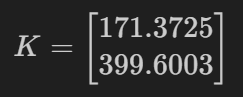
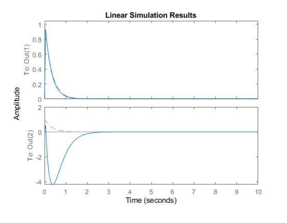

# HoverCopter Project
## Libraries Used:
### 6302view
Throughout this project we used 6302view, an interactive GUI that can be used to monitor and update variables in real time. It includes GUI components such as sliders, buttons, and plots. The GUI can be started by running local_server.py and then launching gui.html in a web browser. The repository for this library is found here: https://github.com/almonds0166/6302view/tree/master/6302view.

### Encoder
In order to measure the angle of the hovercopter's arm, we used a TRDA-2E shaft angle encoder (SAE). The AiEsp32RotaryEncoder was used in to retrieve the angle from the hover arm. With the angle measurement we then able to use these measurements to define our state variables of angle and angular velocity.

## Testing the PCB and Hover Arm

### PCB

We started this project by receiving a prebuilt PCB obtained from a previous group. Their PCB is shown above. When testing the PCB we created a simple Arduino script that plotted out essential information such as angle and pwm voltage to ensure the PCB was behaving as expected. We did not have any issues with the PCB itself for the entirety of the project. 

### Hover Arm:
The hover arm was also already assembled for us. There was minimal to no testing involed for the design of the hover arm.

## Dynamic Modelling
In order to model our hovercopter system we needed to obtain measurements to calculate the inertia of the hovercopter arm. Below is a table of our measurements:

| Component     |  Measurement   |
|---------------|----------------|
| Copter Mass   | 0.0132 g       |
| Rod Mass      | 0.0234 g       |
| Rod Lenth     | 0.5021 m       |
| Rod to Pivot  | 0.2902 m       |
| Copter Radius | 0.01 m         |

Using these values we calculated the moment of inertia to be: 0.0017

In addition to these measurements we performed a hanging down test to compare with our simulated model. We created a simple arduino script that would capture angle measurements as the hover copter would swing back and forth after having been dropped from its highest point. These measurements were then plotted in excel to be compared against our MatLab model. The captured data is shown below:

MatLab was then used to develop a model of the hanging down system. We used a liner simulation our state model to get our results. Our model used the following A, B, C, and D matrices:

In developing our model we used a damping coefficient of 0.60. This was used to obtain our best results. These are shown below:

Without Damping

With a Damping Factor of 0.6

## Hand-Placing Poles

Our first step in developing a controller for the hovercopter was to hand place poles. We choose poles of -8.0 and -7.0 for position and angular velocity, respectively. This gave us gain values of 0.135 and 0.0852. We then implemented this to multiply the gains with the state variables in feedback to control the pulse-width modulation output to the motor. 

These gain values initialy did not perform well for our model and we then increased them manually to find gain values of 1.1482 and 1.049. These worked well but were still slightly overdamped and the hover arm experienced slightly "wobbliness" due to this. A video of these results are shown here [Hand Placed Results](videos/hand_placed.mov).

## LQR Pole Placing
 Linear-quadratic regulator control was used next in the development of our controller model. Octave's [lqr() function](https://octave.sourceforge.io/control/function/lqr.html) uses our A and B state space model matrices as weel as a state weighting matric and an input weighting matrix, Q and R, to set the gains. The Q matrix defines the "weight" of each state variable and how quickly it should be corrected. The R matrix represents the cost of control to correct the system back to where it should be.

When developing this model we used the Q and R matrix shown below:

Using these Q and R matrix we obtained eigenvalues of -3.1725 and -168.8093. This corresponded to gain values of 2.9725 and 1.0139.

Overall this system performed significantly better than we used our hand placed poles. You can view our results for this here: [LQR Results](videos/lqr_placed.mov)

## Kalman Full Order Observer
A Kalman full order observer can be used to estimate the next state variables from the inputs of a system. The full order observer was modeled in MatLab using the poles obtained using LQR. The K gain matrix was obtained:

 Below is the simulated response of the system with this K matrix:

 

 While we were able to simulate the system we were unable to properly implement the Kalman full order observer into our device code. See the results here: [Kalman Full Order Observer Results](videos/kalman_placed.mov)